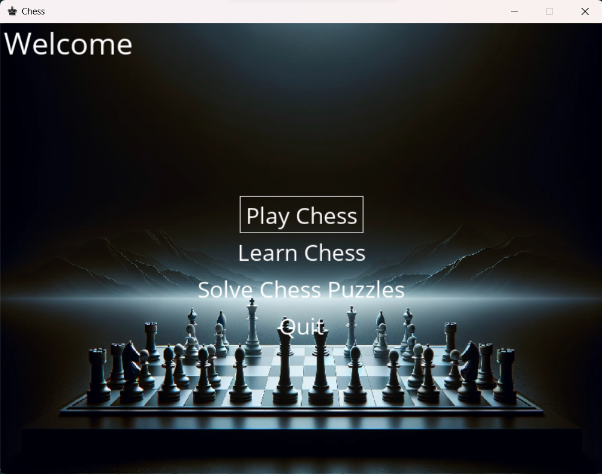
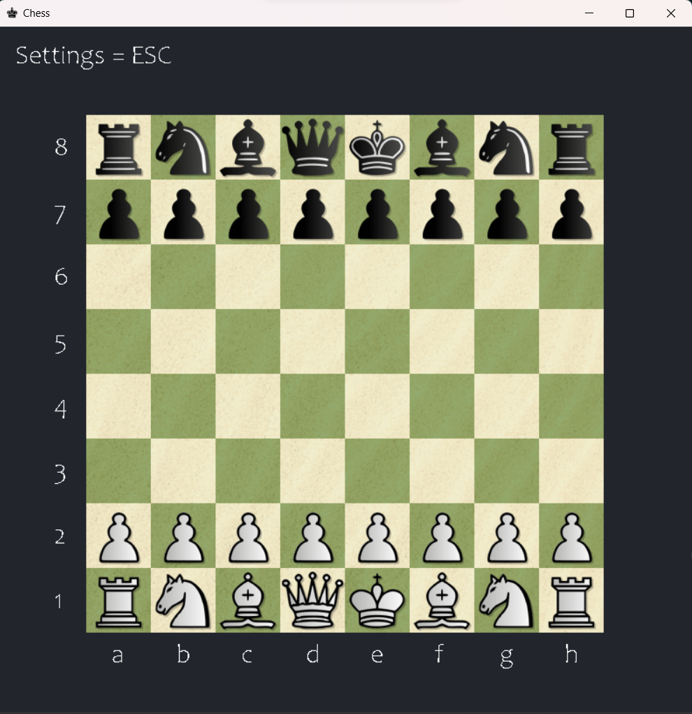
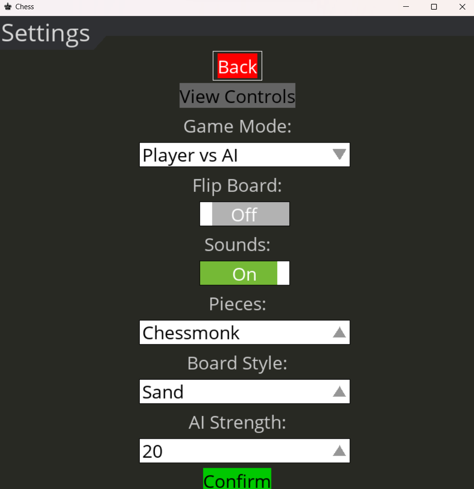

# CheckMate Academy   

## Overview
CheckMate Academy is a chess game offering a variety of puzzles, chess modes, and tutorials. It is built using Python, Pygames, and incorporates the Stockfish Engine.

## Features
- Built chess game app integrating Stockfish Engine for player vs AI and AI vs AI modes.
- Incorporated chess puzzles and tutorials to enhance user engagement and learning experience.
- Implemented features such as hint provision for the next move, diverse chess modes, and real-time evaluation of the current game state, enhancing user experience and strategic decision-making support.

## Screenshots





## Installation

1. Clone the repository:
```bash
git clone https://github.com/Vinu-1975/Checkmate-Academy.git
```
2. Navigate to the project directory:
```bash
cd Checkmate-Academy
```
3. Setup & Activate the virtual environment (if using):
```bash
python -m venv env  # for Windows
python3 -m venv myenv # for Unix/Linux

env\Scripts\activate    # for Windows
source env/bin/activate  # for Unix/Linux
```
4. Install dependencies:
```bash
pip install -r requirements.txt
```
5. Run `Chess.py`
